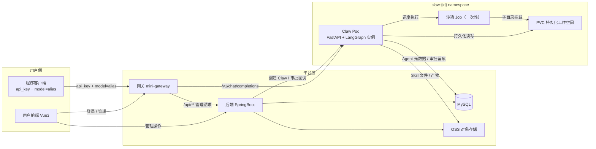
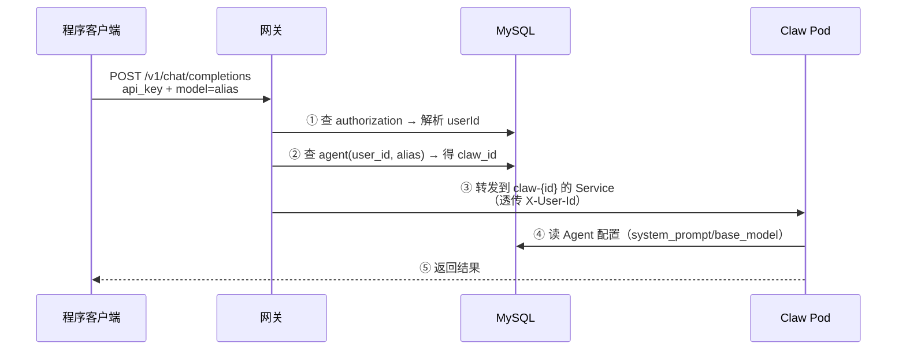
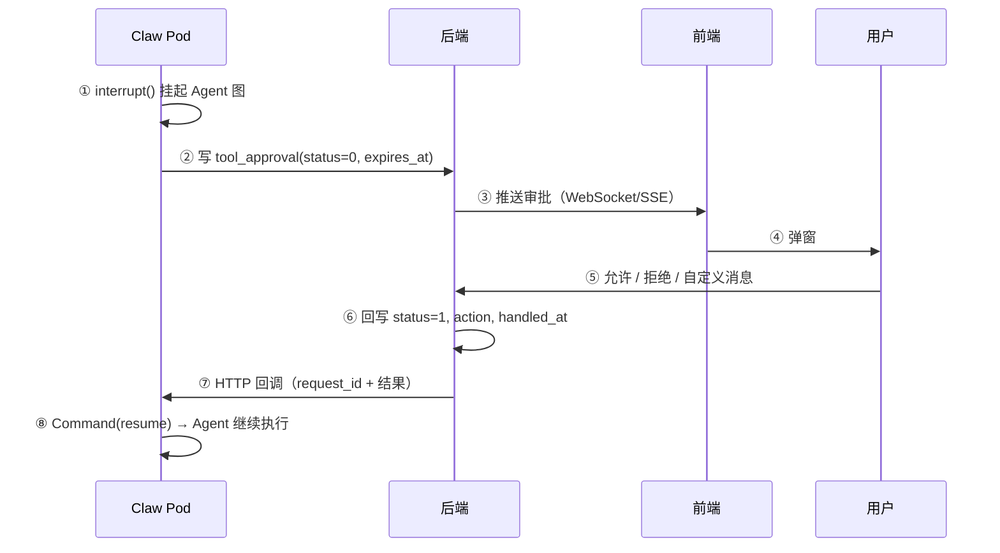
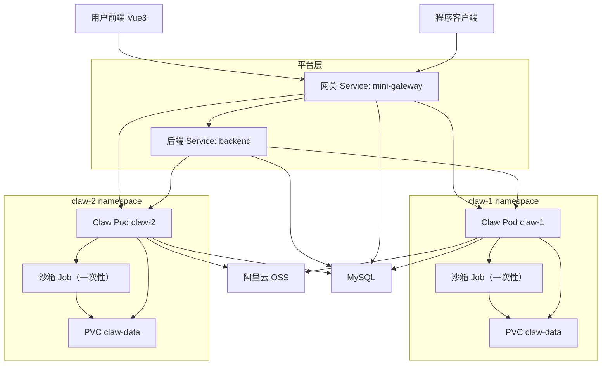

# 系统总览

该项目实现了一个 SaaS Claw 平台，平台通过 K8s（因为当前属于我的个人项目，所以选用 K3s）进行管理。

用户通过登录进入平台，可创建多个 Claw，每个 Claw 被部署在独立 namespace（claw-{id}）下，通过 Pod 隔离。

用户可以在自己的 Claw 中创建 Agent，同一 Claw 中的多个 Agent 可以互相感知，通过路由或用户手动指定进行 Agent 选择。

Agent 运行时可以使用工具，涉及到敏感工具时，需要弹窗给用户进行手动确认（允许、拒绝或用户自定义消息），工具审批记录需要留痕。

平台提供 Agent 商店与 Skill 商店，用户可以手动安装心仪的 Agent 或 Skill，Agent 在运行过程中遇到自身能力难以解决的问题时也可以自动搜索相关商店进行引入安装。

## 组件构成

平台由以下组件构成。

**网关（mini-gateway）**

网关主要负责认证鉴权、限流控制、并发控制，通过校验后将请求转发到相应 uri。

**后端（backend）**

后端主要负责后台任务，包括用户注册、登录、组织管理（预留）、Claw 创建、Agent 与 Skill 安装、Agent 商店、Skill 商店等。

**Claw 服务（runtime）**

Claw 服务作为中台，镜像集中开发、按 Claw 实例部署，提供 Agent 运行时的一切 Harness，包括工具调用、Skill 调用、Agent 路由等。

**前端（frontend）**

前端主要负责用户交互，向用户展示可交互 UI。

## 组件交互总览

## 核心业务流

### 流 1 - 程序调用 Agent（核心链路）

### 流 2 - 敏感工具审批（状态机 + 回调）

### 流 3 - Claw 创建与部署

前端 → 后端：创建 Claw。

后端：
1. 写 claw 表
2. 调 K8s API：创建 namespace claw-{id}
3. 创建 PVC（claw-data）
4. 部署常驻 Claw Pod（runtime 镜像）

### 流 4 - 商店安装

#### 安装 Agent

前端 → 后端：安装商店 Agent。

后端：
1. 复制 agent 记录（source='shop'）→ local_agent_id 关联
2. 同时复制其人格文件（agent_file，新 OSS 副本）
3. 同时安装其依赖的私有 Skill（依赖引用）
4. 部署进用户指定 Claw

用户可在副本上调整参数，原商店资源不受影响。

#### 安装 Skill

前端 → 后端：安装商店 Skill。

后端：
1. 复制 skill 记录 → local_skill_id 关联（skill_installation 表）
2. 复制文件（SKILL.md + 脚本）→ 生成本地 skill_file 记录
3. 文件落 OSS 新副本，避免与原文件互相影响

用户可在副本上编辑，原商店 Skill 不受影响。

### 流 5 - Skill 三种创建入口

| 入口 | 使用者 | 方式 |
| :--: | :--: | :--: |
| 表单 | 专业用户 | 上传 SKILL.md + 脚本 → 写 skill/skill_file + OSS |
| 对话式 create_skill 工具 | 非程序员 | 对 Agent 说“把刚才流程总结为 Skill”，LLM 生成 |
| 自动沉淀 | Agent 运行中 | 把解决问题的流程自动归纳为 Skill |

### 流 6 - 沙箱执行

Claw Pod 内 Agent 要执行不可信脚本：
1. 调度同 namespace 的一次性沙箱 Job
2. 沙箱挂载 PVC 子目录（subPath: task-{request_id}）
3. 限制：CPU/内存 limits、activeDeadlineSeconds 超时、默认禁网、只读 rootfs、非 root 用户
4. 执行完 → 结果回传 Claw Pod → Job 销毁

## 运行拓扑

### 部署位置

| 组件 | 位置 | 说明 |
|------|------|------|
| 网关 mini-gateway | K3s 集群内（平台层）| 须在集群内，才能解析 Claw Pod 的 Service DNS |
| 后端 backend | K3s 集群内（平台层）| 管理接口、Claw 创建、审批回写 |
| Claw Pod | 各自 `claw-{id}` namespace | 每 Claw 一个常驻实例，可横向扩展 |
| 沙箱 Job | Claw 所在 namespace | 一次性，跑完即删 |
| MySQL | 集群内 StatefulSet 或独立部署 | 业务元数据 |
| 阿里云 OSS | 外部云服务 | Skill 文件、Agent 产物 |
| PVC | K3s 集群内（local-path）| 每个 Claw namespace 一块 `claw-data` |

### 网络拓扑要点

1. **唯一对外入口是网关**：前端与程序客户端都只访问网关（NodePort / LoadBalancer / Ingress 任一），网关鉴权后内部分流
2. **网关需访问 MySQL**：它要做两次查询——`api_key → userId`（鉴权）、`(user_id, alias) → claw_id`（路由决策），再解析 `claw-{id}.claw-{id}.svc.cluster.local` 转发到对应 Claw Pod
3. **集群内服务发现**：网关 / 后端 → Claw Pod 走 K8s Service DNS；后端 → Claw Pod 仅一条链路（审批回调）
4. **Claw Pod 不对外暴露**：Claw Pod 只访问 MySQL、OSS、K8s API（调度沙箱），一切外部请求经网关进入

### 隔离边界

外部 ──只能──> 网关（唯一入口）
网关 ──只认──> Claw Pod / 后端（集群内）
Claw Pod ──调度──> 沙箱 Job（同 namespace）
沙箱 ──不能──> 其他用户的 namespace

* 每个 Claw 独立 namespace + 独立 PVC，租户间数据天然隔离
* 不可信脚本只在沙箱 Job 中执行，Claw Pod 不被污染
* 沙箱默认禁网，防止不可信代码横向移动
* 后端通过 RBAC 限制 K8s API 权限：只能操作本用户 Claw 的 namespace